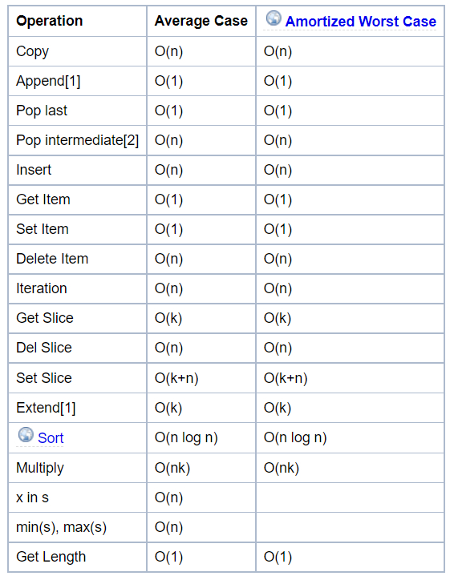
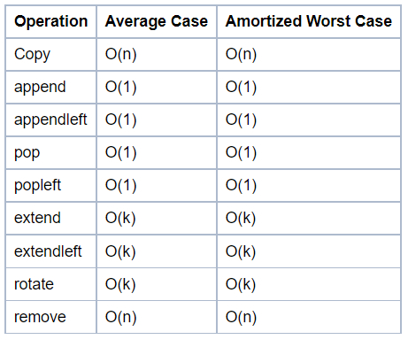
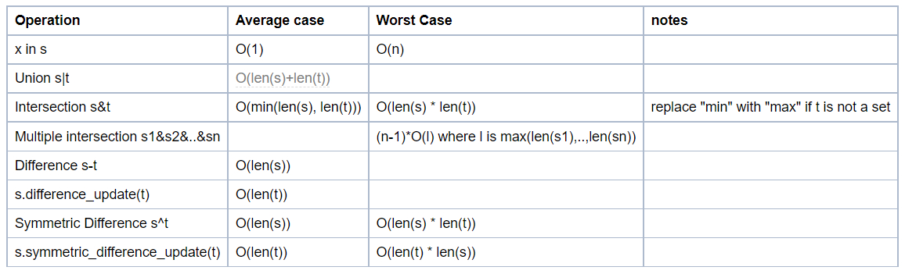
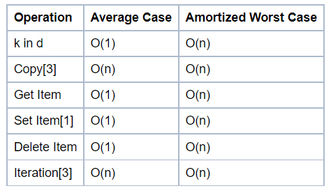

## Algorithm

Algorithm means a solution of a problem.

## Notation

To measure the performance of the algorithm.

## Collection

It is a group of elements.

Types of collections:

- List: can contain all types together
- Arrays: can contain only one type of element

### Time complexities

1. List

The Average Case assumes parameters generated uniformly at random.

Internally, a list is represented as an array; the largest costs come from growing beyond the current allocation size (because everything must move), or from inserting or deleting somewhere near the beginning (because everything after that must move). If you need to add/remove at both ends, consider using a collections.deque instead.



1. collections.deque

A deque (double-ended queue) is represented internally as a doubly linked list. (Well, a list of arrays rather than objects, for greater efficiency.) Both ends are accessible, but even looking at the middle is slow, and adding to or removing from the middle is slower still.



1. Set

As seen in the source code the complexities for set difference s-t or s.difference(t) (set_difference()) and in-place set difference s.difference_update(t) (set_difference_update_internal()) are different! The first one is O(len(s)) (for every element in s add it to the new set, if not in t). The second one is O(len(t)) (for every element in t remove it from s). So care must be taken as to which is preferred, depending on which one is the longest set and whether a new set is needed.

To perform set operations like s-t, both s and t need to be sets. However you can do the method equivalents even if t is any iterable, for example s.difference(l), where l is a list.



1. Dict

The Average Case times listed for dict objects assume that the hash function for the objects is sufficiently robust to make collisions uncommon. The Average Case assumes the keys used in parameters are selected uniformly at random from the set of all keys.

Note that there is a fast-path for dicts that (in practice) only deal with str keys; this doesn't affect the algorithmic complexity, but it can significantly affect the constant factors: how quickly a typical program finishes.



Source - https://wiki.python.org/moin/TimeComplexity

---

## Linked List

Linkedlist implementation is there in the code file `2. linked-list.py`.

## Stack

It is like a stack of elements. It is used in LIFO (Last in, fast out)

Push -> put an element on the top
Pop -> delete the topmost element

Stack implementation is there in the code file `3. stack.py`.

## Queue

It uses FIFO, First in, first out.

Head -> element1 -> element2 -> ... -> Tail

Head : first element and the oldest element in the queue, also called peek.

Tail : latest new element added into the queue.

Dequeue : Remove an element from head, is called dequeue.

Enqueue : Add a new element at the tail, it is call enqueue.

**Dequeue:** Can perform dequeue and enqueue from both ends.

**Priority Queue :** Each element has a priority, we remove the highest priority element first. If two element has the same priority then oldest one is removed.

Stack implementation is there in the code file `4. queue.py`.

---

## Searching and Sorting

## Binary Search

A search with O(logn) complexity in sorted array.

## Recursion

Function calls itself with a base condition.

## Sorting

**Inplace Sorting** : No need for extra space to sort the elements.

### Bubble sort

It is a naive algorithm. It is inplace algorithm.

Time Complexity:

- Worse case - O(n^2)
- Average case - O(n^2)
- Best case - O(n)

Space Complexity: O(1)

### Merge Sort

It is based on divide and conquer. This is **not** a inplace algorithm.

Time Complexity - O(n log(n))
Space Complexity - O(n)

### Quick Sort

You select a random index and move all the larger element to right side and all the smaller element to the left side. The random index is called pivot.
Then you recursively select pivot in the left and right array. Convention is to choose last element in the array as a pivot.

Time Complexity -

- Worse case - O(n^2) (when the pivot is already at right place)

- Average and Best case - O(n log(n)) (Pivot is moved to the middle)

Space Complexity - O(1)

## Some more data structures

1. Map: We can store values as a key value pair. If I need to get a perticular value then I need to use the key to find it's value.
2. Set: In set, there is not a particular ordering of element and set also doesn't allow duplicate element.

## Hashing

To get value in constant time.

```python
Load Factor = Number of Entries / Number of Buckets
```

### Hash Map

https://www.youtube.com/watch?v=APAbRkrqDVI
